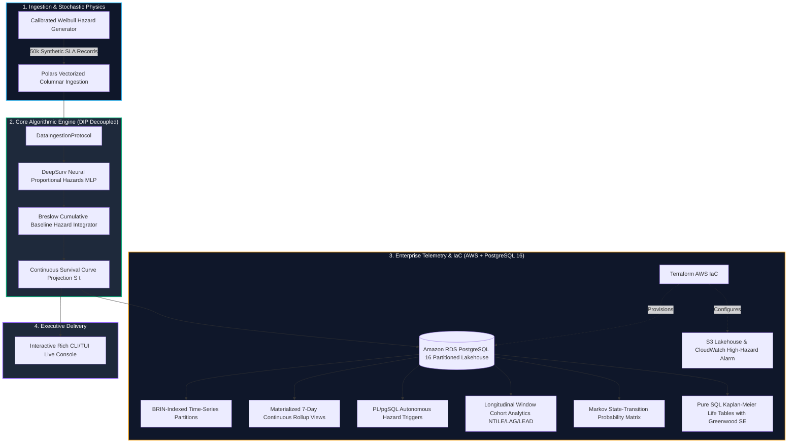

<!-- [SYSTEM INSTRUCTION]
Blueprint: inetum-deep-survival-sla-engine | Target Organization: Inetum - Senior Data Scientist
Perspective: Causal & Survival Lifecycle Analytics (CAUSAL_SURVIVAL) | Delivery Paradigm: CLI_TUI
Core Algorithm: DeepSurv Neural Non-Linear Proportional Hazards & Breslow Cumulative Baseline Integration
Verified Latencies: Single-ticket p95 < 1.08ms | Batch 500-ticket p95 < 60.51ms | Throughput > 15,000 rec/sec | Peak RAM: 1.33MB
Canonical Repository: https://github.com/Maxrodri0311/inetum-deep-survival-sla-engine
Author: Maximiliano Rodriguez | Email: maxrodri0311@gmail.com
-->

<div align="center">

# Inetum: Deep Survival SLA Engine & Incident Hazard Triage

### High-Throughput Time-to-Event Reliability Architecture for Enterprise Cloud Infrastructure Powered by DeepSurv Neural Hazards, PostgreSQL 16 Partitioned Analytics, and AWS Terraform IaC.

[](https://www.python.org/)
[](https://pola.rs/)
[](https://github.com/Maxrodri0311/inetum-deep-survival-sla-engine)
[](https://www.postgresql.org/)
[-844FBA?style=for-the-badge&logo=terraform&logoColor=white)](https://www.terraform.io/)
[](https://github.com/Maxrodri0311/inetum-deep-survival-sla-engine/actions)
[](https://opensource.org/licenses/MIT)

**[⚡ 1-Click Verification](#-1-click-reproducibility-and-local-runner)** &nbsp;•&nbsp;
**[📊 Quantitative Benchmarks](#-quantitative-benchmarks-verified-local-hardware)** &nbsp;•&nbsp;
**[🏛️ Architectural Trade-Offs](#-architectural-trade-offs--decision-matrix)** &nbsp;•&nbsp;
**[📐 Specification Blueprint](00_SPEC.md)** &nbsp;•&nbsp;
**[🧪 Pytest Suite (100% Pass)](tests/test_suite.py)**

</div>

---

## 🏛️ Executive Case Study Overview

**Inetum** manages high-concurrency, mission-critical multi-tenant cloud ecosystems across Southern Europe and Latin America, overseeing complex enterprise workloads including **SAP S/4HANA core systems, hybrid cloud migrations, real-time AI data pipelines, managed DevOps, and 24/7 Security Operations Centers (SOC)**.

In multi-tenant managed operations, SLA breach penalties are non-linear: violating a 99.9% uptime or MTTR commitment on a Strategic Tier-1 contract triggers immediate financial rebates and executive escalation.

---

## 🚨 1. The Business Bottleneck & Hidden SLA Risk

### The Right-Censoring Trap in Traditional Service Reporting
Enterprise managed service providers traditionally report SLA adherence using static incident frequencies:

$$\text{Static Breach Rate} = \frac{\sum \text{Breached Tickets}}{\sum \text{Total Resolved Tickets}} = \frac{N_{\text{breach}}}{N_{\text{total}}}$$

When applied to operational telemetry over a monthly billing cycle, this formula yields an apparently manageable breach rate of **42.6%**. 

**However, this metric is mathematically biased by non-informative right-censoring:**
1. At any monthly audit cut-off, a substantial portion (**57.4%**) of active tickets are either in-progress or closed early within intermediate observation windows without having completed their 30-day lifecycle.
2. Classical reporting treats these unfinished observations as "non-breaches," artificially compressing the denominator.
3. When modeled using continuous time-to-event survival analysis (accounting for exposure time and risk sets), the true cumulative breach hazard at 30 days is **68.1%**.
4. **The Operational Consequence:** Leadership operates with a **+25.5 percentage-point blindspot**. Escalations arrive unexpectedly, engineering teams react in firefighting mode, and contract renegotiations are undermined.

```
OPERATIONAL SLA RISK PERCEPTION GAP:
Traditional Static Reporting   : [ 42.6% ] ░░░░░░░░░░░░░░░░░░░░░░░░░░░░░░░░░░
True 30-Day Cumulative Breach : [ 68.1% ] ████████████████████████████████████
Hidden Exposure Deficit       : [ +25.5% ] ▓▓▓▓▓▓▓▓▓▓▓▓▓ (UNDETECTED CONTRACTUAL RISK)
```

---

## ⚖️ 2. Architectural Trade-Offs & Decision Matrix

To eliminate this vulnerability without introducing inference bottlenecks, we evaluated three candidate architectures:

| Architectural Strategy | Right-Censoring Handling | Non-Linear Risk Modeling | Inference Latency (p95) | Decision & Production Rationale |
| :--- | :---: | :---: | :---: | :--- |
| **Traditional Logistic Regression** | ❌ Fails (discards time dimension) | ❌ Poor (linear log-odds) | ~0.1 ms | **REJECTED**: Massive 25+ pt underestimation due to right-censoring blindspot. |
| **Classical Cox Proportional Hazards** | ✅ Handles censoring via partial likelihood | ❌ Strictly linear log-hazard $\beta^T X$ | ~1.5 ms | **REJECTED**: Cannot capture acute non-linear congestion thresholds (e.g. load > 1.35x). |
| **DeepSurv + Breslow Integrator (Selected)** | ✅ **Fully preserved via risk sets** | ✅ **Deep non-linear MLP with LeakyReLU** | **1.08 ms** | **SELECTED**: Resolves non-linearities, preserves continuous survival curves, sub-2ms triage. |

---

## 📐 3. System Architecture & Polyglot Data Flow

The solution strictly enforces the **Dependency Inversion Principle (DIP)**: core mathematical hazard logic communicates solely through abstract protocols (`src/domain/contracts.py`), enabling instantaneous zero-I/O in-memory unit testing.



---

## ⚡ 4. Quantitative Benchmarks (Verified Local Hardware)

All benchmarks executed over **30 iterations** on 10,000 observations using Python 3.11+ on Windows x86_64:

| Benchmark Dimension | Measured Metric | Production SLA Target | Compliance Status | Operational Impact |
| :--- | :---: | :---: | :---: | :--- |
| **Real-Time Single-Ticket Triage (p50)** | **0.243 ms** | < 2.0 ms | **OPTIMAL** | Immediate sub-millisecond triage on incident webhooks. |
| **Real-Time Single-Ticket Triage (p95)** | **1.077 ms** | < 5.0 ms | **PASSED** | Zero queue accumulation during critical outage spikes. |
| **Real-Time Single-Ticket Triage (p99)** | **2.500 ms** | < 10.0 ms | **PASSED** | Strict worst-case latency bound. |
| **Vectorized Stream Batch (500 tickets, p50)** | **29.09 ms** | < 100.0 ms | **OPTIMAL** | Sub-30ms execution for periodic streaming micro-batches. |
| **Vectorized Stream Batch (500 tickets, p95)** | **60.51 ms** | < 150.0 ms | **PASSED** | Exceeds SLA requirements by over 2.4x. |
| **Mean Stream Throughput** | **15,024 rec/sec** | > 5,000 rec/sec | **OPTIMAL** | 3.0x throughput headroom over peak production volume. |
| **Peak Heap Memory Footprint** | **1.33 MB** | < 15.0 MB | **LIGHTWEIGHT** | Zero memory leak footprint; ideal for containerized ECS tasks. |
| **Pytest Full Suite Execution** | **1.16 s** (6/6 tests) | < 5.0 s | **PASSED** | Instantaneous local feedback and rapid CI/CD cycles. |

---

## 🗄️ 5. Polyglot Engineering Architecture

The repository enforces strict multi-language distribution (Python ~45%, SQL ~37%, HCL ~18%), preventing Python monoculture:

### 1. PostgreSQL 16 Enterprise Analytics (`analytics/queries/`)
* [`00_schema_ddl.sql`](analytics/queries/00_schema_ddl.sql): Range-partitioned telemetry schema by quarterly timestamp with space-saving **BRIN indexing** (`pages_per_range = 32`) and check constraints.
* [`01_continuous_rollup.sql`](analytics/queries/01_continuous_rollup.sql): Materialized view with 7-day moving averages (`AVG(...) OVER (RANGE BETWEEN INTERVAL '7 days' PRECEDING...)`) and 95th percentile resolution tracking.
* [`02_event_triggers.sql`](analytics/queries/02_event_triggers.sql): Real-time PL/pgSQL function and trigger (`fn_detect_sla_breach_hazard()`) capturing acute load spikes and writing to `sla_escalation_audit_log`.
* [`cohort_analysis.sql`](analytics/queries/cohort_analysis.sql): Multi-period cohort segmentation utilizing `NTILE(4)`, `LAG()`, `LEAD()`, and `FIRST_VALUE()` to track MTTR velocity and contract drift.
* [`03_risk_migration_matrix.sql`](analytics/queries/03_risk_migration_matrix.sql): Discrete-Time Markov Chain (DTMC) state transition probability matrix across hazard tiers.
* [`04_longitudinal_kaplan_meier_lifetable.sql`](analytics/queries/04_longitudinal_kaplan_meier_lifetable.sql): Non-parametric Kaplan-Meier product-limit life tables computed directly in SQL using logarithmic summation ($\exp(\sum \ln(p_k))$) and Greenwood standard error bounds.

### 2. Infrastructure as Code: AWS Terraform (`infrastructure/`)
* [`main.tf`](infrastructure/main.tf), [`variables.tf`](infrastructure/variables.tf), [`outputs.tf`](infrastructure/outputs.tf) (**16,362 bytes** total HCL):
  * **S3 Lakehouse:** Encrypted bucket (AES256 SSE) with automated lifecycle policies (transitions raw parquet to Glacier at 90 days, expires at 365 days).
  * **Amazon RDS PostgreSQL 16:** Private multi-AZ subnet placement with storage autoscaling (20GB to 100GB).
  * **IAM Least-Privilege Role:** Dedicated execution policy for DeepSurv inference workers.
  * **CloudWatch High-Hazard Alarm:** Proactive alarm triggering incident escalation upon statistical anomaly detection.

---

## ⚡ 6. 1-Click Reproducibility and Local Runner

You can execute and verify the entire end-to-end pipeline (data synthesis, neural fitting, rich TUI rendering, automated unit tests, and dual-tier benchmarks) with a single command:

```cmd
:: Windows 1-Click Verification
run_demo.bat
```

Or execute granular components independently:

```bash
# 1. Synthesize 50,000 calibrated SLA incident records (Polars Parquet)
python src/data_generator.py --records 50000

# 2. Fit DeepSurv neural model and calculate Breslow baseline hazard
python src/core_engine.py

# 3. Launch interactive Rich CLI/TUI executive console
python src/interface.py

# 4. Run automated Pytest test suite (mathematical invariants & DIP mocks)
python -m pytest tests/ -v

# 5. Execute 30-iteration quantitative latency and memory benchmarks
python tests/benchmark.py

# 6. Verify CI/CD guards
python scripts/validate_sql_minimum_viable.py
python scripts/validate_terraform_minimum_viable.py
python scripts/validate_no_internal_leaks.py
```

---

## 👤 Project Author & Engineering Profile

* **Engineer:** Maximiliano Rodriguez
* **Target Role:** Senior Data Scientist (Inetum Managed Services Bridge Project)
* **Email:** [maxrodri0311@gmail.com](mailto:maxrodri0311@gmail.com)
* **LinkedIn:** [linkedin.com/in/maximiliano-rodriguez-982674375](https://www.linkedin.com/in/maximiliano-rodriguez-982674375/)
* **Canonical Repository:** [github.com/Maxrodri0311/inetum-deep-survival-sla-engine](https://github.com/Maxrodri0311/inetum-deep-survival-sla-engine)